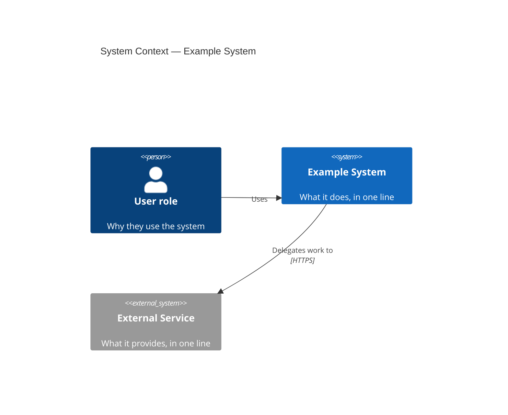
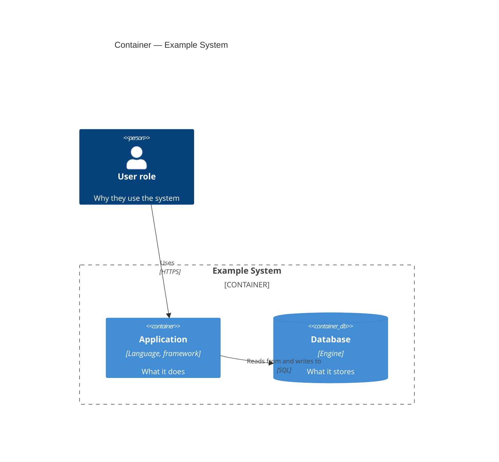

# C4 Architecture Diagrams Implementation Plan

> **For agentic workers:** REQUIRED SUB-SKILL: Use superpowers:subagent-driven-development (recommended) or superpowers:executing-plans to implement this plan task-by-task. Steps use checkbox (`- [ ]`) syntax for tracking.

**Goal:** Extend the diataxis-docs skill so a run derives C4 System Context
and Container diagrams from the codebase and embeds them, as Mermaid C4
syntax, in one *About the architecture* explanation page.

**Architecture:** A new rule sheet `references/diagrams.md` (original MIT
text, C4 attribution) carries all diagram rules; SKILL.md gains small wiring
in Phase 0 (evidence harvest), Phase 1 (approvable plan item), and the
explanation phase (conditional sheet load). Licensing text in both READMEs
and the plan-file reference doc are updated to match.

**Tech Stack:** Markdown only. Verification uses `@mermaid-js/mermaid-cli`
via `npx` to prove the skeleton diagrams render with the canonical palette.

**Spec:** `docs/superpowers/specs/2026-08-02-c4-diagrams-design.md` — read it
before starting any task.

## Global Constraints

- Repo: `/Users/peter/Projects/diataxis`. All paths below are repo-relative.
- Prose wraps at ~75 columns, matching every existing file in the repo.
- C4 levels are **Context and Container only** — no Component, Code,
  Deployment, Dynamic, or Landscape anywhere in any file.
- Mermaid stable subset only: `Person`, `System`, `System_Ext`, `Container`,
  `ContainerDb`, `System_Boundary`, `Container_Boundary`, `Rel`, `Rel_Back`,
  `title`. `UpdateElementStyle`, `UpdateRelStyle`, `UpdateLayoutConfig` are
  forbidden.
- Canonical palette (verified 2026-08-02, Mermaid 11 defaults): person
  `#08427B`, system `#1168BD`, container `#438DD5`, external `#999999`.
- `references/diagrams.md` is **original work under MIT** — it must NOT
  carry the Procida CC BY-SA header the other sheets use.
- Commit after each task; imperative-mood commit messages like the existing
  history (`git log --oneline`).

---

### Task 1: Create `references/diagrams.md`

**Files:**
- Create: `skills/diataxis-docs/references/diagrams.md`

**Interfaces:**
- Produces: the rule sheet that Task 2's SKILL.md edits point to by the
  exact path `references/diagrams.md`, and two fenced ```mermaid skeleton
  blocks (C4Context, C4Container) that the render test extracts.

- [ ] **Step 1: Write the file with exactly this content**

````markdown
> Original rule-sheet text, copyright © Peter Knego, licensed under the
> MIT License (see repo-root LICENSE). Describes the
> [C4 model](https://c4model.com) created by Simon Brown; c4model.com
> content is licensed under
> [CC BY 4.0](https://creativecommons.org/licenses/by/4.0/). Notation
> summarized from c4model.com, 2026-08-02.

# Diagrams: rules for C4 architecture diagrams

## Purpose

Loaded alongside `references/explanation.md` — never alone — when the
approved plan includes the *About the architecture* explanation page.
Governs deriving C4 System Context and Container diagrams from the
codebase and embedding them in that page. The diagrams illustrate the
*why*; the surrounding prose carries it.

## Enforced

- **Levels: System Context and Container only.** If the user asks for
  Component or Code level, record a not-created entry in the plan with
  reason ("below the maintainable line; drifts from code faster than
  reruns occur") and remedy ("maintain by hand outside the generated
  set, or use IDE tooling") — never silently draw it.
- **Every element traces to evidence.** Each person, system, and
  container maps to something the Phase 0 harvest actually found: a
  dependency, a config file, a deploy manifest, an API client, a
  documented user role. No invented boxes, no assumed external systems —
  the diagram equivalent of reference's "no invented API". While
  drafting, note the evidence source for each element in the plan file,
  not in the published page.
- **Thin-repo rule.** A codebase with a single deployable unit gets a
  Context diagram only; its Container diagram is recorded as not
  created, with reason ("one container — the Context diagram already
  shows it") and remedy ("becomes creatable if the system splits into
  multiple deployable units").
- **Notation.** Every element carries name + technology + one-line
  responsibility. Every relationship is a labeled, directed arrow. No
  mixed abstraction levels in one diagram. Diagram titles name the level
  and the system: "System Context — X", "Container — X".
- **Register.** The page must still pass the explanation sheet's closing
  self-check (compass + bath test). A diagram dropped in with no
  surrounding narrative fails this check.
- **Mermaid stable subset only.** Fenced ```mermaid blocks using
  `C4Context` / `C4Container` with: `Person`, `System`, `System_Ext`,
  `Container`, `ContainerDb`, `System_Boundary`, `Container_Boundary`,
  `Rel`, `Rel_Back`, `title`. Nothing else — the C4 grammar is marked
  experimental in Mermaid, and the subset above is the part stable in
  practice.
- **Default styling only.** Mermaid's C4 defaults are fixed
  (theme-independent) and are the canonical c4model.com palette: person
  `#08427B`, system `#1168BD`, container `#438DD5`, external `#999999`
  (verified 2026-08-02, Mermaid 11). `UpdateElementStyle`,
  `UpdateRelStyle` and `UpdateLayoutConfig` are forbidden — the defaults
  already produce the standard C4 look, and overrides are the first
  thing to break across renderer versions.

## Forbidden

- Component, Code, Deployment, Dynamic, or System Landscape diagrams.
- Elements without recorded evidence.
- Style or layout override directives.
- Replacing an existing hand-drawn architecture diagram without an
  explicit, approved plan item. Existing diagrams found in Phase 0 are
  classified by the compass and annotated keep/move/split like any other
  content; they are never deleted in favor of generated ones.

## Skeletons

Start from these shapes; replace the placeholder text, keep the
structure.





## Closing self-check

Run before closing the explanation phase, in addition to the explanation
sheet's own self-check:

- Every element traces to an evidence note recorded in the plan file.
- Only stable-subset keywords appear; no style or layout directives.
- Each diagram title names its level and system.
- The page reads as explanation with the diagrams removed — the prose
  carries the *why* on its own.
````

- [ ] **Step 2: Verify the skeletons render with the canonical palette**

Extract both fenced mermaid blocks and render them with mermaid-cli:

```bash
cd /Users/peter/Projects/diataxis
python3 - <<'EOF'
import re
text = open('skills/diataxis-docs/references/diagrams.md').read()
blocks = re.findall(r'```mermaid\n(.*?)```', text, re.S)
assert len(blocks) == 2, f"expected 2 mermaid blocks, got {len(blocks)}"
for name, block in zip(('context', 'container'), blocks):
    open(f'/tmp/c4-{name}.mmd', 'w').write(block)
print("extracted OK")
EOF
npx -y @mermaid-js/mermaid-cli -i /tmp/c4-context.mmd -o /tmp/c4-context.svg
npx -y @mermaid-js/mermaid-cli -i /tmp/c4-container.mmd -o /tmp/c4-container.svg
grep -o '#08427B\|#1168BD\|#999999' /tmp/c4-context.svg | sort -u
grep -o '#08427B\|#438DD5' /tmp/c4-container.svg | sort -u
```

Expected: both `mmdc` runs exit 0 and produce SVGs; the first grep prints
`#08427B`, `#1168BD`, `#999999`; the second prints `#08427B`, `#438DD5`.
If `mmdc` fails to parse, fix the skeleton in `diagrams.md` (not the
extracted copy) and re-run. If `npx` cannot fetch mermaid-cli (offline),
record that the render check is pending and continue — but say so in the
task report; do not claim it passed.

- [ ] **Step 3: Check the header is NOT the Procida header**

```bash
grep -L "Daniele Procida" skills/diataxis-docs/references/diagrams.md
```

Expected: prints the file path (meaning the name is absent).

- [ ] **Step 4: Commit**

```bash
git add skills/diataxis-docs/references/diagrams.md
git commit -m "Add C4 diagrams rule sheet"
```

---

### Task 2: Wire `diagrams.md` into SKILL.md

**Files:**
- Modify: `skills/diataxis-docs/SKILL.md`

**Interfaces:**
- Consumes: `references/diagrams.md` from Task 1 (path referenced
  verbatim).
- Produces: Phase 0 step named "Architecture-evidence harvest", Phase 1
  paragraph proposing the "About the architecture" page — Task 3's
  plan-file doc update refers to both by these names.

All four edits are exact-string replacements; the current file matches the
old strings verbatim.

- [ ] **Step 1: Renumber Phase 0 step 7 to 8**

Old:
```
7. **Classify existing docs.**
```
New:
```
8. **Classify existing docs.**
```

- [ ] **Step 2: Insert the architecture-evidence harvest as step 6, renumbering old step 6 to 7**

Old:
```
6. **Need-evidence harvest.**
```
New:
```
6. **Architecture-evidence harvest.** Identify deployable units, external
   systems, and actors — from deploy manifests (docker-compose,
   Kubernetes, Procfile), service entry points, external API clients, and
   documented user roles — recording where each item was found. This
   evidence backs the C4 diagrams proposed for the architecture
   explanation page; the rules live in `references/diagrams.md`, loaded
   only in the explanation phase.
7. **Need-evidence harvest.**
```

- [ ] **Step 3: Add the architecture page as a Phase 1 plan item**

Old:
```
A bare "not
created" with no reason and remedy cannot be approved.
```
New:
```
A bare "not
created" with no reason and remedy cannot be approved.

When the architecture-evidence harvest found material for them, the plan
proposes an *About the architecture* explanation page carrying C4
diagrams, naming each proposed level — System Context, Container — in
the entry. A level without evidence behind it (e.g. a single deployable
unit makes a Container diagram redundant) is recorded as a not-created
entry with reason and remedy, exactly like a quadrant. If the docs
tooling detected in Phase 0 cannot render Mermaid, note that in the plan
and propose the fallback — a plain fenced code block with a rendering
note — as an approvable item rather than silently degrading. Plan
approval covers the page and its levels; the diagram rules live in
`references/diagrams.md`.
```

- [ ] **Step 4: Make the explanation phase load the diagrams sheet conditionally**

Old:
```
  - Explanation: `references/explanation.md`
```
New:
```
  - Explanation: `references/explanation.md` — plus
    `references/diagrams.md` when the approved plan includes the
    architecture page
```

- [ ] **Step 5: Update the SKILL.md licensing paragraph**

Old:
```
This file (`SKILL.md`) is original work, copyright © Peter Knego, licensed
under the MIT License. The rule sheets under `references/` are adaptations
of [diataxis.fr](https://diataxis.fr) content, copyright © Daniele Procida,
licensed under CC BY-SA 4.0 — each carries its own attribution header.
```
New:
```
This file (`SKILL.md`) is original work, copyright © Peter Knego, licensed
under the MIT License. The rule sheets under `references/` are adaptations
of [diataxis.fr](https://diataxis.fr) content, copyright © Daniele Procida,
licensed under CC BY-SA 4.0 — each carries its own attribution header —
except `references/diagrams.md`, which is original MIT-licensed text
describing the [C4 model](https://c4model.com) by Simon Brown (c4model.com
content is CC BY 4.0).
```

- [ ] **Step 6: Verify the wiring**

```bash
cd /Users/peter/Projects/diataxis
grep -n "diagrams.md" skills/diataxis-docs/SKILL.md
grep -n "Architecture-evidence harvest" skills/diataxis-docs/SKILL.md
awk '/^## Phase 0/,/^## Phase 1/' skills/diataxis-docs/SKILL.md | grep -E '^[0-9]+\.'
```

Expected: `diagrams.md` appears 4 times (Phase 0 step, Phase 1 paragraph,
explanation sheet list, licensing); the Phase 0 step list runs 1–8 with no
gaps or duplicates.

- [ ] **Step 7: Commit**

```bash
git add skills/diataxis-docs/SKILL.md
git commit -m "Wire C4 diagrams sheet into the phase workflow"
```

---

### Task 3: Update licensing text and the plan-file reference doc

**Files:**
- Modify: `skills/diataxis-docs/README.md`
- Modify: `README.md`
- Modify: `docs/reference/plan-file.md`

**Interfaces:**
- Consumes: the file `references/diagrams.md` (Task 1) and the Phase 1
  item wording "About the architecture" (Task 2).

- [ ] **Step 1: Amend the skill README licensing bullet**

In `skills/diataxis-docs/README.md`, old:
```
- `references/` contains adaptations of [diataxis.fr](https://diataxis.fr)
  content, copyright © Daniele Procida, licensed under
  [CC BY-SA 4.0](https://creativecommons.org/licenses/by-sa/4.0/). Each file
  in `references/` carries its own attribution header.
```
New:
```
- `references/` contains adaptations of [diataxis.fr](https://diataxis.fr)
  content, copyright © Daniele Procida, licensed under
  [CC BY-SA 4.0](https://creativecommons.org/licenses/by-sa/4.0/) — except
  `references/diagrams.md`, which is original MIT-licensed text describing
  the [C4 model](https://c4model.com) by Simon Brown (c4model.com content
  is CC BY 4.0). Each file in `references/` carries its own attribution
  header.
```

- [ ] **Step 2: Amend the root README licensing section**

In `README.md`, old:
```
- **Diátaxis material** — the extracted pages under [site/txt/](site/txt/)
  and the rule sheets adapted from them under
  [skills/diataxis-docs/references/](skills/diataxis-docs/references/) — is
  copyright © Daniele Procida and licensed under
  [CC BY-SA 4.0](https://creativecommons.org/licenses/by-sa/4.0/), as stated
  in the website's
  [source repository](https://github.com/evildmp/diataxis-documentation-framework).
```
New:
```
- **Diátaxis material** — the extracted pages under [site/txt/](site/txt/)
  and the rule sheets adapted from them under
  [skills/diataxis-docs/references/](skills/diataxis-docs/references/)
  (all except `diagrams.md`) — is
  copyright © Daniele Procida and licensed under
  [CC BY-SA 4.0](https://creativecommons.org/licenses/by-sa/4.0/), as stated
  in the website's
  [source repository](https://github.com/evildmp/diataxis-documentation-framework).
- **C4 model attribution** — `references/diagrams.md` is original
  MIT-licensed text describing the [C4 model](https://c4model.com) created
  by Simon Brown; c4model.com content is licensed under
  [CC BY 4.0](https://creativecommons.org/licenses/by/4.0/).
```

- [ ] **Step 3: Document diagram evidence notes in the plan-file reference**

In `docs/reference/plan-file.md`, two edits.

First, old:
```
The reference subsection additionally carries the proposed **scope**
statement. Scope is an approvable item in its own right: the user approves
it separately from the document list.
```
New:
```
The reference subsection additionally carries the proposed **scope**
statement. Scope is an approvable item in its own right: the user approves
it separately from the document list.

The explanation subsection names, for the *About the architecture* page,
each proposed C4 diagram level (System Context, Container). A level
without evidence behind it appears under not-created entries instead.
```

Second, old:
```
### Parking lot — *transient*
```
New:
```
### Diagram evidence notes — *transient*

One note per diagram element while the architecture page is drafted:
which harvested evidence (deploy manifest, dependency, API client,
documented role) the element traces to. Checked by the diagrams sheet's
closing self-check; removed by the Phase 6 trim.

### Parking lot — *transient*
```

- [ ] **Step 4: Verify all three files**

```bash
cd /Users/peter/Projects/diataxis
grep -n "diagrams.md" README.md skills/diataxis-docs/README.md
grep -n "Diagram evidence notes" docs/reference/plan-file.md
```

Expected: each README shows its new text; plan-file.md lists the new
transient section before the parking lot.

- [ ] **Step 5: Commit**

```bash
git add README.md skills/diataxis-docs/README.md docs/reference/plan-file.md
git commit -m "Extend licensing and plan-file docs for C4 diagrams"
```

---

### Task 4: Version bump and final consistency check

**Files:**
- Modify: `.claude-plugin/plugin.json`

**Interfaces:**
- Consumes: all previous tasks committed.

- [ ] **Step 1: Bump the plugin version**

In `.claude-plugin/plugin.json`, old:
```
  "version": "1.2.1",
```
New:
```
  "version": "1.3.0",
```
(Minor bump: new capability, no breaking change. Repo convention is that a
patch bump follows later, after a validation rerun on a real repo — see
the spec's Testing section; that rerun is not part of this plan.)

- [ ] **Step 2: Full-repo consistency check**

Prohibited constructs may be *named* in prohibition prose, but must not
appear inside any actual diagram block:

```bash
cd /Users/peter/Projects/diataxis
python3 - <<'EOF'
import re
text = open('skills/diataxis-docs/references/diagrams.md').read()
blocks = "".join(re.findall(r'```mermaid\n(.*?)```', text, re.S))
for bad in ('C4Component', 'C4Deployment', 'C4Dynamic',
            'UpdateElementStyle', 'UpdateRelStyle', 'UpdateLayoutConfig'):
    assert bad not in blocks, f"forbidden construct in skeleton: {bad}"
print("skeletons clean")
EOF
git status --porcelain
```

Expected: `skeletons clean`; `git status` shows only the plugin.json
change.

- [ ] **Step 3: Commit**

```bash
git add .claude-plugin/plugin.json
git commit -m "Bump to 1.3.0: C4 architecture diagram support"
```
