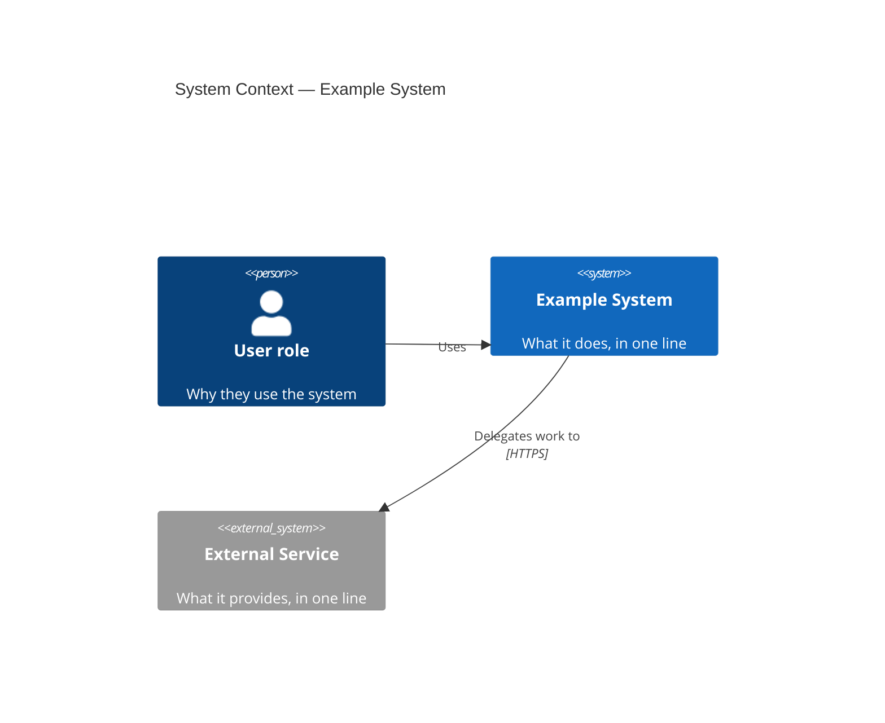
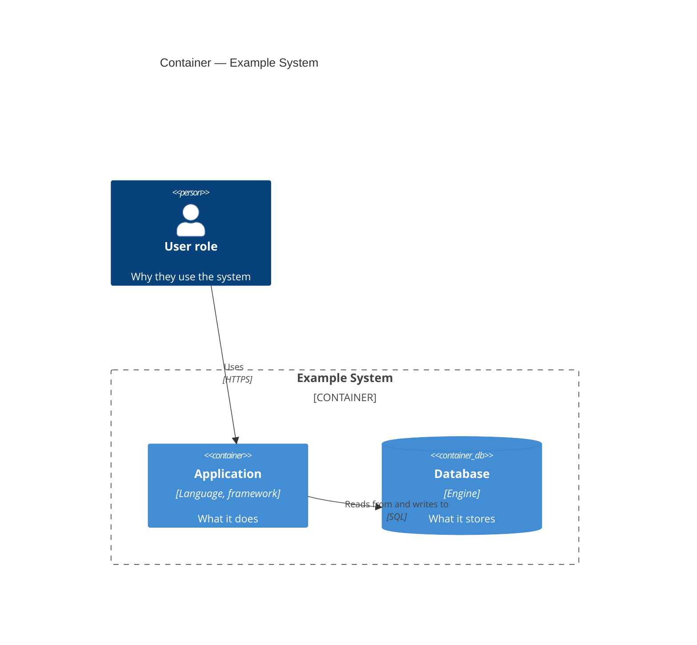

> Original rule-sheet text, copyright © Peter Knego, licensed under the
> MIT License (see repo-root LICENSE). Describes the
> [C4 model](https://c4model.com) created by Simon Brown; c4model.com
> content is licensed under
> [CC BY 4.0](https://creativecommons.org/licenses/by/4.0/). Notation
> summarized from c4model.com, 2026-08-02.

# Diagrams: rules for C4 architecture diagrams

## Purpose

Loaded alongside `references/explanation.md` — never alone — when the
approved plan includes the *About the architecture* explanation page.
Governs deriving C4 System Context and Container diagrams from the
codebase and embedding them in that page. The diagrams illustrate the
*why*; the surrounding prose carries it.

## Enforced

- **Levels: System Context and Container only.** If the user asks for
  Component or Code level, record a not-created entry in the plan with
  reason ("below the maintainable line; drifts from code faster than
  reruns occur") and remedy ("maintain by hand outside the generated
  set, or use IDE tooling") — never silently draw it.
- **Every element traces to evidence.** Each person, system, and
  container maps to something the Phase 0 harvest actually found: a
  dependency, a config file, a deploy manifest, an API client, a
  documented user role. No invented boxes, no assumed external systems —
  the diagram equivalent of reference's "no invented API". While
  drafting, note the evidence source for each element in the plan file,
  not in the published page.
- **Thin-repo rule.** A codebase with a single deployable unit gets a
  Context diagram only; its Container diagram is recorded as not
  created, with reason ("one container — the Context diagram already
  shows it") and remedy ("becomes creatable if the system splits into
  multiple deployable units").
- **Notation.** Every element carries name + technology + one-line
  responsibility. Every relationship is a labeled, directed arrow. No
  mixed abstraction levels in one diagram. Diagram titles name the level
  and the system: "System Context — X", "Container — X".
- **Register.** The page must still pass the explanation sheet's closing
  self-check (compass + bath test). A diagram dropped in with no
  surrounding narrative fails this check.
- **Mermaid stable subset only.** Fenced `mermaid` code blocks using
  `C4Context` / `C4Container` with: `Person`, `System`, `System_Ext`,
  `Container`, `ContainerDb`, `System_Boundary`, `Container_Boundary`,
  `Rel`, `Rel_Back`, `title`. Nothing else — the C4 grammar is marked
  experimental in Mermaid, and the subset above is the part stable in
  practice.
- **Default styling only.** Mermaid's C4 defaults are fixed
  (theme-independent) and are the canonical c4model.com palette: person
  `#08427B`, system `#1168BD`, container `#438DD5`, external `#999999`
  (verified 2026-08-02, Mermaid 11). `UpdateElementStyle`,
  `UpdateRelStyle` and `UpdateLayoutConfig` are forbidden — the defaults
  already produce the standard C4 look, and overrides are the first
  thing to break across renderer versions.

## Forbidden

- Component, Code, Deployment, Dynamic, or System Landscape diagrams.
- Elements without recorded evidence.
- Style or layout override directives.
- Replacing an existing hand-drawn architecture diagram without an
  explicit, approved plan item. Existing diagrams found in Phase 0 are
  classified by the compass and annotated keep/move/split like any other
  content; they are never deleted in favor of generated ones.

## Skeletons

Start from these shapes; replace the placeholder text, keep the
structure.

## Closing self-check

Run before closing the explanation phase, in addition to the explanation
sheet's own self-check:

- Every element traces to an evidence note recorded in the plan file.
- Only stable-subset keywords appear; no style or layout directives.
- Each diagram renders: walk the Mermaid syntax mentally — balanced
  boundary braces, quoted strings, declared identifiers in every `Rel`
  — and verify on a rendering-capable host when one is available.
- Each diagram title names its level and system.
- The page reads as explanation with the diagrams removed — the prose
  carries the *why* on its own.
